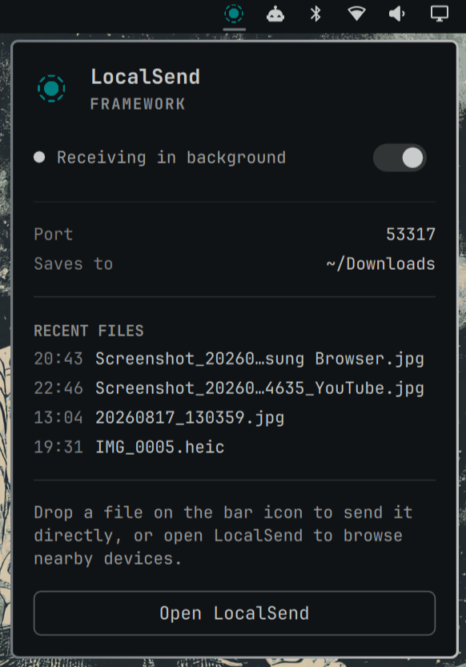

# omarchy-localsend

[](LICENSE)
[](https://github.com/omacom/omarchy)

A bar-widget plugin for the [Omarchy](https://omarchy.org) shell that brings
[LocalSend](https://localsend.org) (via the `localsend-cli` package) into the
bar — send and receive files over the LAN without leaving your desktop.



## Features

- **Always reachable (opt-in)** — turn on background receiving and a hidden
  `localsend-cli` instance keeps this PC reachable at any time, popup open or
  not. Off by default: the plugin never runs anything in the background
  until you explicitly enable it.
- **Drag and drop to send** — drop one or more files on the bar icon to pick
  a nearby device and send them.
- **Click to pair** — click the icon to open the `localsend-cli` TUI in a
  floating terminal and browse/pair nearby devices.
- **Arrival badge + notifications** — a dot appears on the icon and a desktop
  notification fires when a file arrives; the popup lists the last few files
  received.

## Requirements

| Requirement | Why |
|---|---|
| `localsend-cli` on `$PATH` (`localsend` package) | Does the actual sending/receiving |
| `inotifywait` (`inotify-tools` package) | Watches the destination folder for the recent-files list and arrival notifications |
| `bash` | The interactive-launch helper script and every background process it manages |
| `python3` | Opens the dropped-file list with a race-free, no-follow read (`os.open(..., O_NOFOLLOW)`) — bash's own redirections have no equivalent, so without `python3` a dropped-file transfer silently sends with no files attached rather than falling back to a weaker read |
| `tmux` (recommended) | Keeps this PC reachable in the background. Without it, `localsend-cli` only listens while the widget's terminal is open — it has no daemon mode of its own |
| `systemd` user session (`systemctl --user`, `systemd-run`) | The background receiver runs in its own systemd user scope so it can be terminated completely — including any child processes — rather than by PID alone. Standard on Arch/Omarchy; not a separate package to install |

## Install

```bash
omarchy plugin add https://github.com/jccl1706/omarchy-localsend.git --enable --yes
```

<details>
<summary>Install by hand</summary>

```bash
cp -r . ~/.config/omarchy/plugins/io.github.jccl1706.localsend
omarchy-shell shell rescanPlugins
omarchy plugin enable io.github.jccl1706.localsend
```

For local development, a symlink in place of `cp -r` works too, but
`omarchy-shell`'s file watcher does not follow it — after editing QML, run
`omarchy restart shell` rather than relying on hot-reload.

</details>

## Usage

| Action | Result |
|---|---|
| Idle, background receiving on | Background receiver keeps this PC reachable; popup status row shows "Receiving in background" |
| Idle, background receiving off (default) | Only reachable while the widget's terminal is open |
| Click the bar icon | Opens the `localsend-cli` TUI in a floating terminal to browse and pair nearby devices |
| Drop files on the bar icon | Opens the same TUI, pre-loaded with those files — pick a device to send |
| Close the floating terminal | Background receiver comes back automatically |
| Click the icon again / click outside | Opens or closes the popup — shows device alias, port, download destination, and recently received files |

A dot on the bar icon marks a file that arrived while the popup was closed;
it clears the next time you open the popup.

## Configuration

- **Background receiving** — off by default; toggle in the popup (persisted
  to `shell.json`). Also available over IPC:
  ```bash
  omarchy-shell io.github.jccl1706.localsend toggleBackgroundReceiving
  ```
  Disabling or removing the plugin kills the background listener and deletes
  its generated helper files. The listener also polls its own installed
  plugin directory and shuts itself down within a few seconds of that
  directory disappearing even if the shell wasn't running to unload it
  first — e.g. `omarchy plugin remove` while the shell is stopped.
- **Everything else** — reflects `localsend-cli`'s own config. Edit
  `~/.config/localsend-cli/config.toml` to change the alias, port, or
  download destination (see the comments in that file); the recent-files
  list and notifications follow the same destination folder automatically.

## Removal

```bash
omarchy plugin remove io.github.jccl1706.localsend --yes
```

Or by hand: `omarchy plugin disable io.github.jccl1706.localsend`, then
delete `~/.config/omarchy/plugins/io.github.jccl1706.localsend/`.

## Files

| File | Purpose |
|---|---|
| `manifest.json` | Plugin manifest (`kind: bar-widget`) |
| `Widget.qml` | Bar icon, popup panel, and drag-and-drop handling |
| `LICENSE` | MIT |

<details>
<summary>Implementation notes</summary>

The widget writes a small helper script to
`~/.local/state/omarchy-localsend/interactive.sh` on load, and (when sending)
a `pending-files.list` alongside it. Both exist because the launch command
passes through `omarchy-launch-or-focus-tui`'s own argv handling, which
flattens and re-parses it along the way, corrupting anything with shell
metacharacters: an inline semicolon-chained `bash -c "a; b; c"` string loses
everything after the first `;`, and even a single quoted argument loses its
quotes — a file path containing a space silently splits into two arguments.
A plain script path plus a plain list-file path have no such characters to
lose; the file paths themselves travel via the list file's contents instead
of argv.

The bar icon is resolved from the system's installed icon theme at runtime
(`Quickshell.iconPath("localsend", true)`, the `localsend` package installs
it) rather than a bundled copy — LocalSend's Apache-2.0 license covers its
code, not a redistribution grant over its mark.

</details>

## License

MIT — see [LICENSE](LICENSE).
